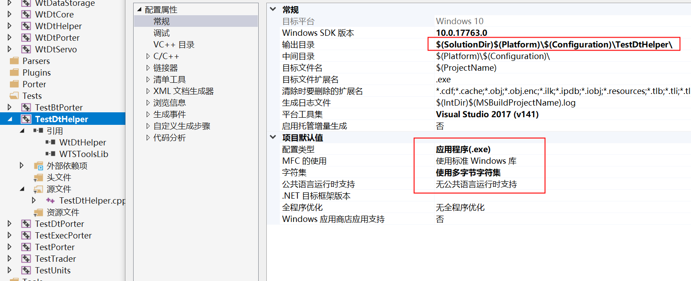
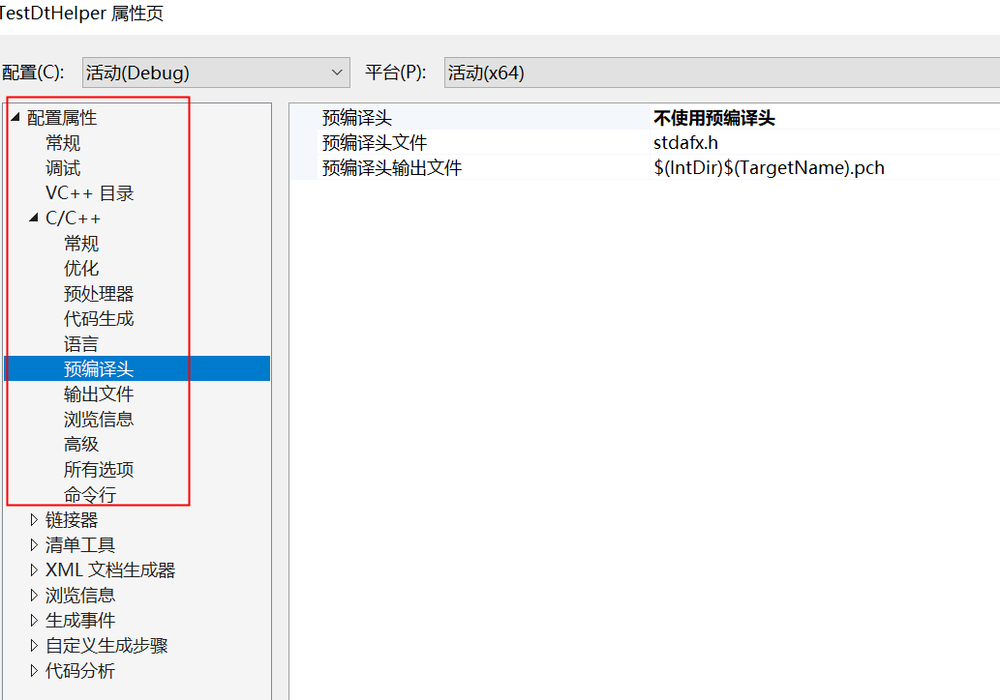
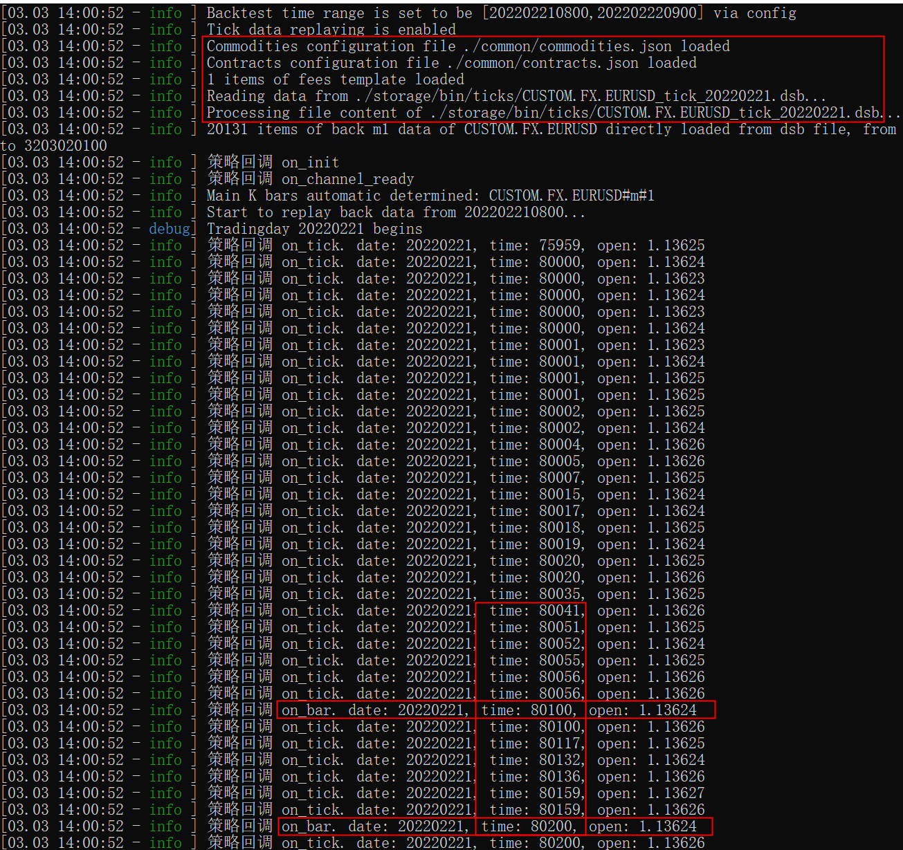
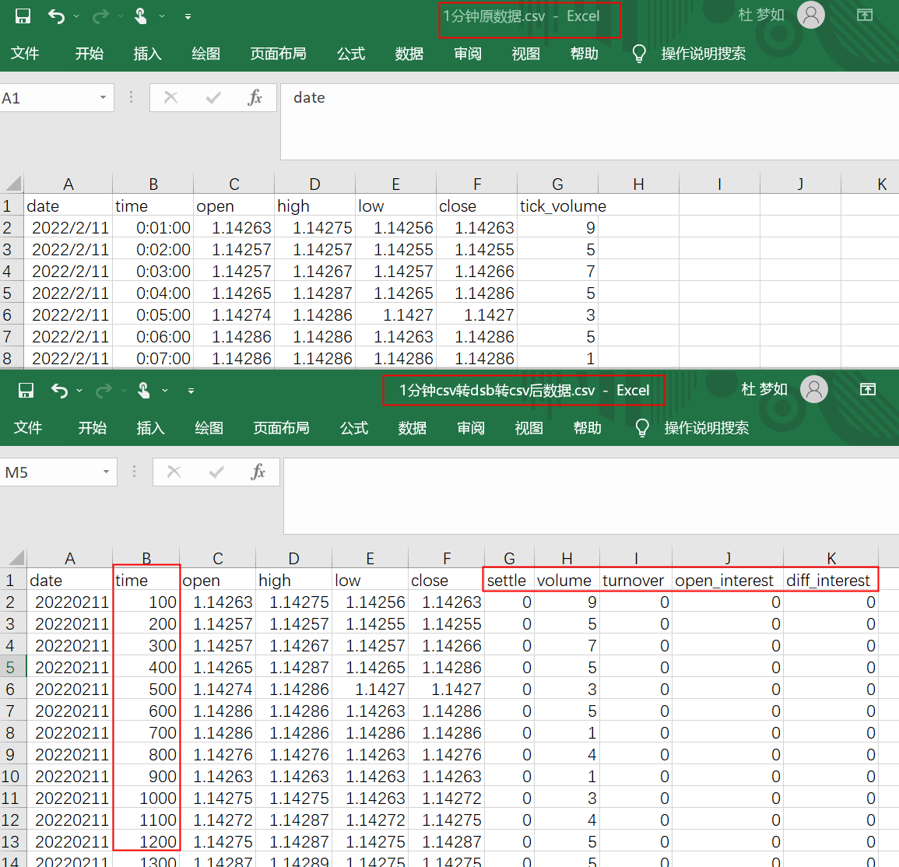
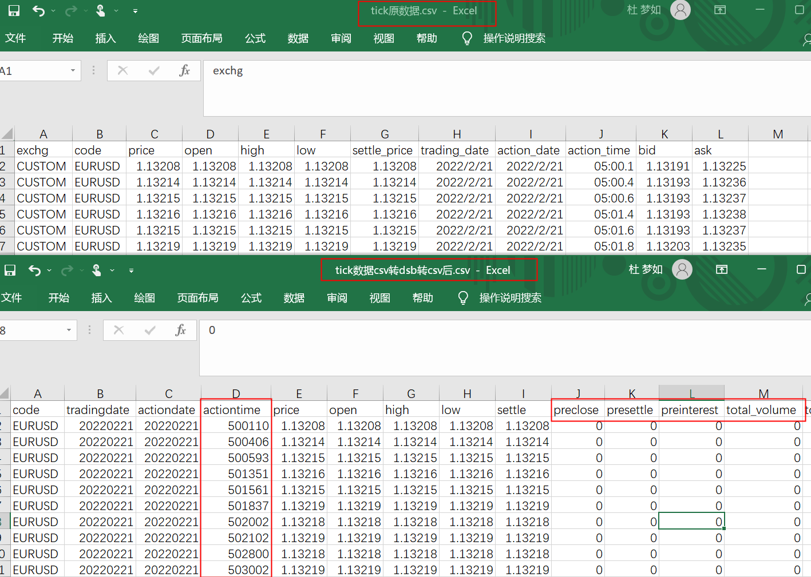

# 数据压缩/解压

source: `{{ page.path }}`

```tip
1. 数据转换功能主要在 `WtDtHelper.cpp`

2. 所有日期和时间都是数值型时间, 其中bar数据time字段需要计算,精确到分; tick数据action_time字段需要计算, 精确到毫秒
```

## **WonderTrader**数据存储方式
&emsp;&emsp;**WonderTrader**实盘环境下支持两种数据存储方式：**文件存储**和**数据库存储**。而回测环境下，还支持直接从`csv`读取数据（仅限于历史K线数据）。

### 文件存储
&emsp;&emsp;历史K线数据文件，采用`zstd`压缩后存放。高频历史数据，包括`tick`数据，股票`level2`的委托明细、成交明细、委托队列，也采用压缩存放的方式。A股全市场一天的`level2`数据，压缩以后也就是大概**2G不到**的样子，对于硬盘来说是相当友好的。
&emsp;&emsp;实时数据文件，因为需要实时读写，所以不压缩数据结构，并采用**mmap**的方式映射到内存中，直接对文件进行读写，提高读写效率。

### 数据库存储
&emsp;&emsp;数据库存储的方式，**只针对历史K线数据**。实时数据和高频数据的存储方式还是和文件存储模式一致的。
&emsp;&emsp;主要考虑到高频数据量非常巨大，如果采用数据库，整个数据库的运行效率会大大降低。而实时数据对延迟要求非常高，数据库则不适合这样的应用场景了。目前支持的数据库是`mysql`/`mariadb`，以后如果有需求的话，可能会扩展到一些`nosql`数据库。

### csv历史数据
&emsp;&emsp;很多用户通过各种渠道获取到的历史数据，供应商为了便于用户直接查看数据，一般都会提供`csv`格式的。但是`csv`文件格式的数据，占用空间非常大，而且直接从`csv`文件读取数据的开销也是非常大的。
&emsp;&emsp;**WonderTrader**的回测框架为了尽量减少这种不必要的开销，在处理`csv`文件时，第一次会直接从`csv`文件读取，将读取的数据转成**WonderTrader**内部数据结构之后，会将数据转储为**WonderTrader**自有的压缩存放格式。这样下次在使用该数据的时候，读取压缩存放的数据以后，直接解压就可以得到结构化的历史数据，这样就可以直接进行访问了。

## 准备数据

1.自己下载csv原始数据. 

建议使用Python, **处理数据用Python最方便**. 若不是本人不熟悉cpp和py混合编程, 也许本章数据处理内容全部会使用Python代码

2.注意事项: 

wt数据向右对齐, 即5分钟bar数据9:10对应的是9:05-9:10这段时间的高开低收价.(如果你的数据是左对齐, 需自己修改, 参考如下代码)
```python
if timeframe == TIMEFRAME_M1:
    delta_min = 1
elif timeframe == TIMEFRAME_M5:
    delta_min = 5
rates["time"] = rates["time"].map(lambda x: x + timedelta(minutes=delta_min))
```

3.Bar原始数据长相大致如下


4. Tick原始数据长相大致如下(**注意Tick数据action_time**)


## 创建项目环境

1. **Tests下新建项目(TestDtHelper)**
2. 添加引用(WtDtHelper, WTSToolsLib)
3. 添加源文件(TestDtHelper.cpp)

4. 修改项目属性

(**所有重要的项目属性一定要设置好, 不然无法运行程序, 其他属性可参考同目录下TestDtPorter项目属性设置**)


在`TestDtHelper.cpp`添加测试代码确保项目环境配置无误(**如果编译不通过建议检查环境, 不要再往下了**)

```cpp
#pragma once
#define _CRT_SECURE_NO_WARNINGS

#include <iostream>
#include "../../WtDtHelper/WtDtHelper.cpp"
#include "../../WTSTools/CsvHelper.h"
#include "../../Includes/WTSStruct.h"

int main()
{
	return 0;
}
```

## 编写压缩解压文件代码

`WtDtHelper.cpp` 文件有几个重要函数

- `strToDate`: 字符串转数字日期(20220302)
- `strToTime`: 字符串转数字时间(1108)
- `store_bars`: bar数据csv转dsb
- `store_ticks`: tick数据csv转dsb
- `dump_bars`: bar数据dsb转csv
- `dump_ticks`: tick数据dsb转csv

注意事项:
1. 数据压缩时, 日期date字段将保存为数字日期(如20220302), 时间time字段将保存为: 数字日期-1990+数字时间(没有秒)
2. csv读取可用 `CsvHelper.h`
3. 日期时间处理可用 `TimeUtils.hpp`
4. 字符串处理可用 `StrUtil.hpp`

### 数据压缩和解压

#### 1. 准备目录

在 "Debug/TestDtHelper" 目录下新建
- bin
  - m1
  - m5
  - ticks
- csv
  - m1
  - m5
  - ticks
  - out

将准备的分钟csv文件放入csv对应目录下

(bin下将会生成csv转dsb文件, csv/out会保存dsb转csv结果)

#### 2. 修改源码

```dange
由于我的数据是7*24小时数据, 在凌晨一点前, 即小时为0时, 数据计算会出错, 因此修改这里, 此处问了群主**非必要别修改**
```
在 `WtDtHelper.cpp` 中的 `strToTime` 函数下修改一个地方: (>10000 改为 >= 100, 确保时间 `00:01:00` 能正确计算)


#### 3. bar数据

在 `TestDtHelper.cpp` 中编写代码, 主要逻辑是创建bar结构体vector `std::vector<WTSBarStruct> bars;`, 然后填充结构体, 最后调用 `store_bars` 即可. 注意填充bar结构体时对应列名.

1. 注意bar数据time字段需要计算, 精确到分

```cpp
// 回调日志输出
void on_log(const char* message)
{
	printf(message);
	printf("\r\n");
}

void csv_to_bars(WtString csvFolder, WtString binFolder, WtString period, FuncLogCallback cbLogger /* = NULL */)
{
	// 1. 判断目录
	if (!BoostFile::exists(csvFolder))
		return;

	if (!BoostFile::exists(binFolder))
		BoostFile::create_directories(binFolder);
	// 2. 判断数据周期
	WTSKlinePeriod kp = KP_DAY;
	if (wt_stricmp(period, "m1") == 0)
		kp = KP_Minute1;
	else if (wt_stricmp(period, "m5") == 0)
		kp = KP_Minute5;
	else
		kp = KP_DAY;

	// 3. 遍历目录下的csv文件
	boost::filesystem::path myPath(csvFolder);
	boost::filesystem::directory_iterator endIter;
	for (boost::filesystem::directory_iterator iter(myPath); iter != endIter; iter++)
	{
		if (boost::filesystem::is_directory(iter->path()))
			continue;

		if (iter->path().extension() != ".csv")
			continue;

		const std::string& path = iter->path().string();

		if (cbLogger)
			cbLogger(StrUtil::printf("正在读取数据文件%s...", path.c_str()).c_str());

		CsvReader reader(",");
		if (!reader.load_from_file(path.c_str()))
		{
			if (cbLogger)
				cbLogger(StrUtil::printf("读取数据文件%s失败...", path.c_str()).c_str());
			continue;
		}

		std::vector<WTSBarStruct> bars;
		while (reader.next_row())
		{
			uint32_t	date;
			uint32_t	time;
			double		open;		//开
			double		high;		//高
			double		low;		//低
			double		close;		//收
			double		settle;		//结算
			double		money;		//成交金额

			uint32_t	vol;	//成交量
			uint32_t	hold;	//总持
			int32_t		add;	//增仓

			//逐行读取
			WTSBarStruct bs;
			bs.date = strToDate(reader.get_string("date"));
			if (kp != KP_DAY)
				bs.time = TimeUtils::timeToMinBar(bs.date, strToTime(reader.get_string("time")));
			bs.open = reader.get_double("open");
			bs.high = reader.get_double("high");
			bs.low = reader.get_double("low");
			bs.close = reader.get_double("close");
			bs.settle = reader.get_double("settle");
			bs.money = reader.get_double("money");
            // 我的csv文件中 vol 列名是 tick_volume
			bs.vol = reader.get_uint32("tick_volume");
			bs.hold = reader.get_uint32("hold");
			bs.add = reader.get_int32("add");
			
			bars.emplace_back(bs);

			if (bars.size() % 1000 == 0)
			{
				if (cbLogger)
					cbLogger(StrUtil::printf("已读取数据%u条", bars.size()).c_str());
			}
		}
		if (cbLogger)
			cbLogger(StrUtil::printf("数据文件%s全部读取完成,共%u条", path.c_str(), bars.size()).c_str());

		// 保存文件名
		std::string filename = StrUtil::standardisePath(binFolder);
		filename += iter->path().stem().string();
		filename += ".dsb";

		// 保存数据
		store_bars(filename.c_str(), bars.data(), bars.size(), period, on_log);
	}
}

int main()
{
	// csv转dsb
	csv_to_bars("csv/m1", "bin/m1", "m1", on_log);
	// dsb转csv
	dump_bars("bin/m1", "csv/out");

	csv_to_bars("csv/m5", "bin/m5", "m5", on_log);
	dump_bars("bin/m5", "csv/out");

	return 0;
}
```

### 4. tick数据

方法同bar数据处理
```dange
1. 如果是测试, 建议少整点tick数据

2. 如果你的数据精度>3, 比如我使用外汇数据, 精度为5, 则需要修改源码 `dump_ticks`函数下有一句输出精度`ss.precision(5);`(非必要别改源码)

3. **注意tick中action_time字段计算, 而且精确到毫秒**
```

```cpp
// 将毫秒时间转数值时间
uint32_t strToMsTime(const char* strTime)
{
	std::string str;
	const char *pos = strTime;
	while (strlen(pos) > 0)
	{
		if (pos[0] != ':')
		{
			str.append(pos, 1);
		}
		pos++;
	}

	uint32_t ret = atof(str.c_str()) * 1000;

	return ret;
}

void csv_to_ticks(WtString tickFolder, WtString binFolder, FuncLogCallback cbLogger /* = NULL */)
{
	// 1. 判断目录
	if (!BoostFile::exists(tickFolder))
		return;

	if (!BoostFile::exists(binFolder))
		BoostFile::create_directories(binFolder);

	// 2. 遍历目录下的csv文件
	boost::filesystem::path myPath(tickFolder);
	boost::filesystem::directory_iterator endIter;
	for (boost::filesystem::directory_iterator iter(myPath); iter != endIter; iter++)
	{
		if (boost::filesystem::is_directory(iter->path()))
			continue;

		if (iter->path().extension() != ".csv")
			continue;

		const std::string& path = iter->path().string();

		if (cbLogger)
			cbLogger(StrUtil::printf("正在读取数据文件%s...", path.c_str()).c_str());

		CsvReader reader(",");
		if (!reader.load_from_file(path.c_str()))
		{
			if (cbLogger)
				cbLogger(StrUtil::printf("读取数据文件%s失败...", path.c_str()).c_str());
			continue;
		}

		std::vector<WTSTickStruct> ticks;
		while (reader.next_row())
		{
			//逐行读取
			WTSTickStruct ts;
			strcpy(ts.exchg, reader.get_string("exchg"));
			strcpy(ts.code, reader.get_string("code"));
			ts.price = reader.get_double("price");
			ts.open = reader.get_double("open");
			ts.high = reader.get_double("high");
			ts.low = reader.get_double("low");
			ts.settle_price = reader.get_double("settle_price");
			ts.upper_limit = reader.get_double("upper_limit");
			ts.upper_limit = reader.get_double("lower_limit");

			ts.total_volume = reader.get_uint32("total_volume");
			ts.volume = reader.get_uint32("volume");

			ts.total_turnover = reader.get_double("total_turnover");
			ts.turn_over = reader.get_double("turn_over");
			ts.open_interest = reader.get_uint32("open_interest");
			ts.diff_interest = reader.get_int32("diff_interest");

			// 日期和时间(毫秒)注意要计算变形
			ts.trading_date = strToDate(reader.get_string("trading_date"));
			ts.action_date = strToDate(reader.get_string("action_date"));
			// 自定义了一个计算毫秒时间的函数
			ts.action_time = strToMsTime(reader.get_string("action_time"));

			ts.pre_close = reader.get_double("pre_close");
			ts.pre_settle = reader.get_double("pre_settle");
			ts.pre_interest = reader.get_int32("pre_interest");

			ts.bid_prices[0] = reader.get_double("bid");
			ts.ask_prices[0] = reader.get_double("ask");
			ts.bid_qty[0] = reader.get_uint32("bid_qty");
			ts.ask_qty[0] = reader.get_uint32("ask_qty");

			ticks.emplace_back(ts);

			if (ticks.size() % 6000 == 0)
			{
				if (cbLogger)
					cbLogger(StrUtil::printf("已读取数据%u条", ticks.size()).c_str());
			}
		}
		if (cbLogger)
			cbLogger(StrUtil::printf("数据文件%s全部读取完成,共%u条", path.c_str(), ticks.size()).c_str());

		// 保存文件名
		std::string filename = StrUtil::standardisePath(binFolder);
		filename += iter->path().stem().string();
		filename += ".dsb";

		// 保存数据
		store_ticks(filename.c_str(), ticks.data(), ticks.size(), on_log);
	}
}

int main()
{
	//csv_to_bars("csv/m1", "bin/m1", "m1", on_log);
	//dump_bars("bin/m1", "csv/out");

	//csv_to_bars("csv/m5", "bin/m5", "m5", on_log);
	//dump_bars("bin/m5", "csv/out");

	// csv转dsb
	csv_to_ticks("csv/ticks", "bin/ticks", on_log);
	// dsb转csv
	dump_ticks("bin/ticks", "csv/out");

	return 0;
}
```

### 成功验证

1. **bar数据**


2. **tick数据**
